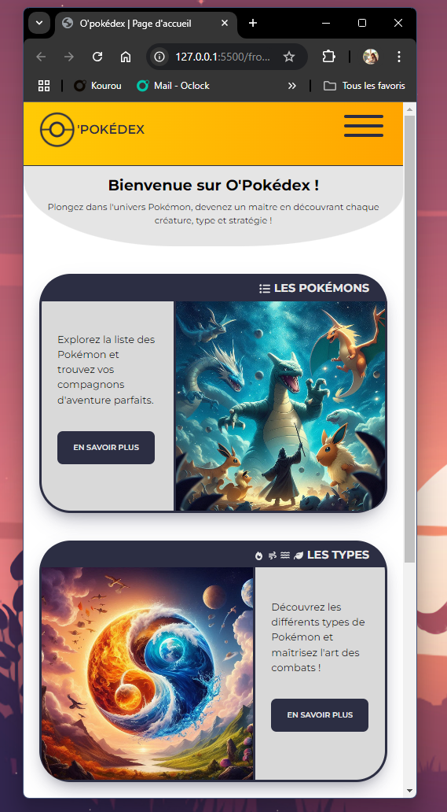

# O'Pokedex

## Contexte

Projet API - du **16/09/24** au **20/09/24**

J'ai du réaliser en 4 jour le projet O'pokedex, Malheureusement par manque de temps j'ai du faire des choix donc je n'ai pas encore implémenté toutes les fonctonnalitées ni pu faire des améliorations en terme d'UI/UX. Celles-ci seront ajouté ultérieurement.

**/!\ Le projet est uniquement développé pour le format mobile, la version responsive arrivera utltèrieurement. c.f : photo ci-dessous**

 
Voir la photo

## Structure du projet :

### Dossier back :

- Un dossier data qui contient les fichiers sql :
  - create_tables.sql : permet de créer les tables de la bases de données
  - seeding_tables.sql : permet de remplir les tables avec les données
- .env.example : les variables d'environnement.
- package.json : contient les dependances & les scripts à installer avec nodemon

### Dossier docs :

- wireframe : Contient les wireframes que j'ai réalisé
- mockup : Contient le rendu maquette mobile que j'ai réalisé avec Figma
- endpoints.md : contient la liste des routes à faire dans l'api
- installation.md : contient une courte série d'instruction pour lancer le projet.
- myprocess.md : contient l'organisation par laquelle je procède
- roadmap.md : contient les différentes features du projet à implémenter sous forme de user-stories.

### Dossier front :

- Un dossier assets qui contient :
  - css : contient tous les fichiers css des différentes pages
  - icons : un dossier qui contient les icons svg
  - img : contient les images des pokémon, les images portent le nom du numero du pokémon (<numero>.webp), et des images
- Toutes les pages HTML du site web sont répertoriées à la racine du dossier front.
